# Zero Trust Sign-In Policies with Microsoft Entra Conditional Access

**Status:** ✅ Built and tested (report-only)

## Video Walkthrough

> 🎥 Loom walkthrough coming soon

## Project Overview

A user's password ends up in a phishing kit. Hours later, someone signs in with it from another country, over an old mail protocol that never asks for MFA. Nothing stops them, because as far as the directory is concerned, the password was correct.

In this lab I built the Conditional Access policies that close those gaps. MFA is required for any sign-in from outside my trusted network, legacy authentication is blocked outright, admin roles require phishing-resistant MFA, and sign-ins from high-risk countries are blocked. Every policy excludes a break-glass account so a mistake can never lock me out of the tenant. The policies, named locations, and groups are deployed with Terraform (`azuread` provider) running as a dedicated app registration with least-privilege Graph permissions. I deployed every policy in report-only mode and validated each one with the What If tool and real sign-ins.

That validation paid off. Report-only showed CA101 would have required MFA from my home network as well as from cellular: my browser signs in over IPv6, and my trusted location only contained my IPv4 address. Enforcing it as built would have prompted every user on my network. Catching that before it affected anyone is exactly what report-only is for.

### Skills Demonstrated

- **Conditional Access** design: assignments, conditions, grant controls, and include/exclude logic
- **Named locations** for trusted IP ranges and countries
- **Authentication strengths**: requiring phishing-resistant MFA for privileged roles
- **Blocking legacy authentication** to stop password spraying against protocols that can't do MFA
- Safe rollout practices: **report-only mode**, the **What If** tool, a pilot-scoped policy, and **break-glass exclusions**
- Validating policy impact in the Entra **sign-in logs**
- **Non-human identity**: a dedicated app registration with scoped Microsoft Graph application permissions and a short-lived secret
- Identity-as-code with Terraform (`azuread` provider)

## Architecture Diagram

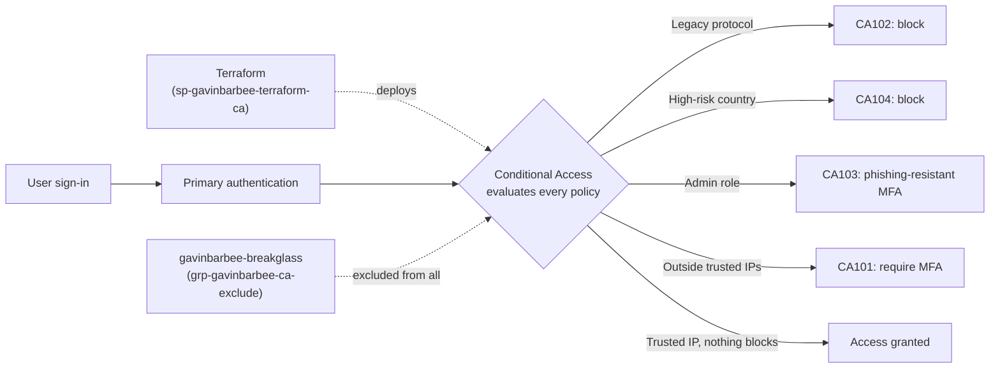

## Prerequisites

- An Entra ID tenant I control that is **not** a production tenant
- Microsoft Entra ID P1 or P2 (I used the P2 trial already active in my lab tenant)
- A tenant-native Global Administrator account (`gavinbarbee-admin@<tenant>.onmicrosoft.com`)
- Security defaults turned off (Conditional Access can't be used alongside them)
- A phone on cellular data, for testing from an untrusted network
- Windows + VS Code + PowerShell
- Azure CLI and Terraform installed

## Naming Conventions

| Object | Name |
| --- | --- |
| Tenant admin | `gavinbarbee-admin` |
| Break-glass account | `gavinbarbee-breakglass` |
| Terraform app registration | `sp-gavinbarbee-terraform-ca` |
| Pilot user | `gavinbarbee-pilotuser` |
| Exclusion group | `grp-gavinbarbee-ca-exclude` |
| Pilot group | `grp-gavinbarbee-ca-pilot` |
| Trusted IP location | `nl-gavinbarbee-trusted-ips` |
| Country location | `nl-gavinbarbee-blocked-countries` |
| Conditional Access policies | `CA101-gavinbarbee-require-mfa-outside-trusted-locations`, `CA102-gavinbarbee-block-legacy-authentication`, `CA103-gavinbarbee-require-phishing-resistant-mfa-for-admins`, `CA104-gavinbarbee-block-high-risk-countries` |

## Project Steps

### 1. Prepare the lab tenant

I reused the lab tenant from my identity governance project, where the P2 trial is already active and security defaults are already off. That tenant already has a policy named `CA001`, so this lab's policies start at `CA101`.

I created a dedicated break-glass account, `gavinbarbee-breakglass`, with the Global Administrator role and a long random password stored in my password manager. I created it in the portal rather than in Terraform on purpose, so a `terraform destroy` can never remove the one account that gets me back into the tenant.

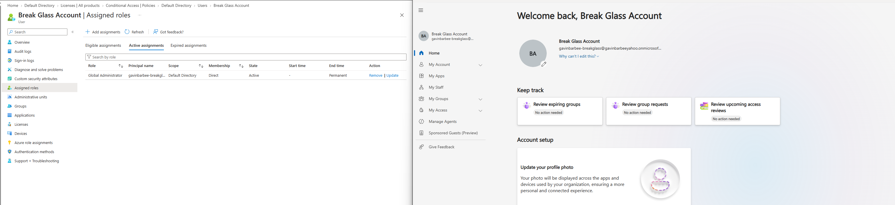

### 2. Create a dedicated identity for Terraform

I created the app registration `sp-gavinbarbee-terraform-ca` instead of reusing my governance lab's deployer, so it only holds what this lab needs. I added these Microsoft Graph **application** permissions and granted admin consent:

| Permission | Used for |
| --- | --- |
| `Policy.Read.All` + `Policy.ReadWrite.ConditionalAccess` | Conditional Access policies and named locations |
| `Application.Read.All` | Conditional Access application references |
| `Group.ReadWrite.All` | Exclusion and pilot groups |
| `User.ReadWrite.All` | Pilot user, and reading the break-glass account |
| `Domain.Read.All` | Looking up the tenant's initial domain |

I created a short-lived client secret and passed it to Terraform only through environment variables in the terminal session, so it never touches a file in the repo.

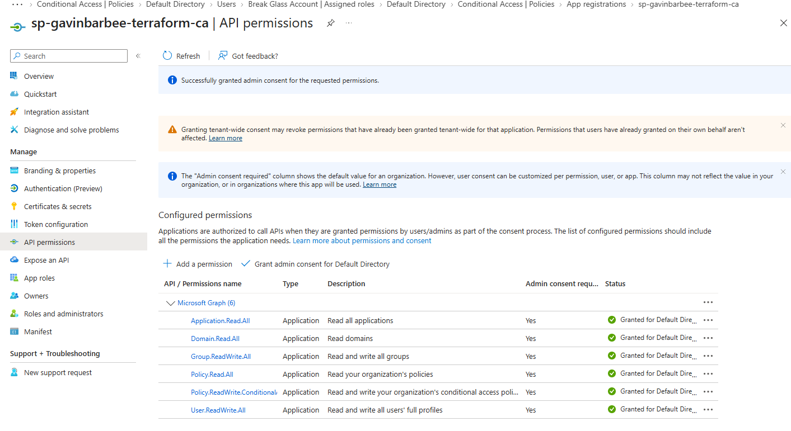

Once Terraform finished, I deleted the client secret so no long-lived credential was left on an app that can rewrite my tenant's sign-in policies.

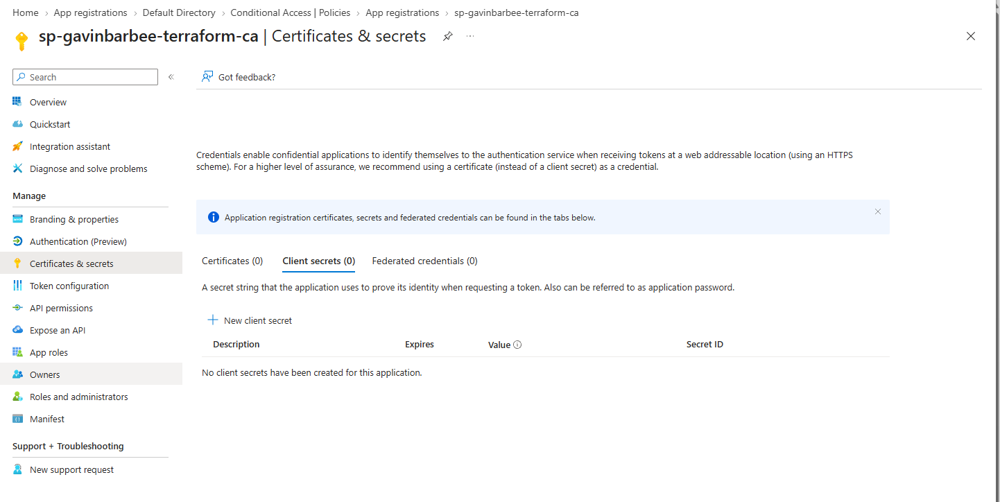

### 3. Deploy everything in report-only mode

```powershell
$env:ARM_TENANT_ID     = '<tenant-id>'
$env:ARM_CLIENT_ID     = '<application-client-id>'
$env:ARM_CLIENT_SECRET = '<client-secret-value>'

# My public IP for the trusted location
Invoke-RestMethod https://api.ipify.org

cd terraform
Copy-Item terraform.tfvars.example terraform.tfvars   # then set tenant_id, break_glass_upn, and trusted_ip_cidrs
terraform init
terraform plan "-out=main.tfplan"
terraform apply main.tfplan
```

This creates the exclusion and pilot groups, the pilot user, both named locations, and all four policies in **report-only** mode. Report-only policies evaluate every sign-in and log what they would have done, without blocking or prompting anyone.

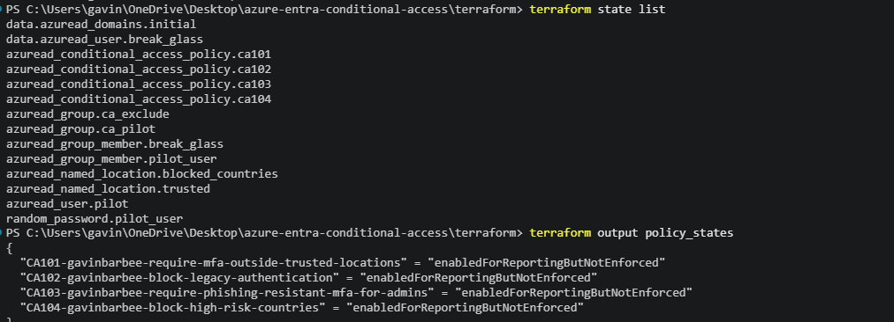
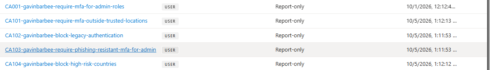

### 4. Review the policies

In Conditional Access → Policies, I opened each policy to confirm its assignments, conditions, and grant controls:

- **CA101** targets the pilot group, includes all locations except `nl-gavinbarbee-trusted-ips`, and requires MFA.
- **CA102** targets all users, applies only to the Exchange ActiveSync and "Other clients" (legacy) client apps, and blocks access.
- **CA103** targets five privileged directory roles and requires the built-in **Phishing-resistant MFA** authentication strength.
- **CA104** targets all users signing in from `nl-gavinbarbee-blocked-countries` and blocks access.

All four exclude `grp-gavinbarbee-ca-exclude`.

CA103 stays in report-only for this lab. Enforcing phishing-resistant MFA before every admin has a passkey or FIDO2 key registered can lock admins out of the tenant. In production I'd register methods for each admin first (using a Temporary Access Pass where needed), confirm coverage in the report-only results, and only then enforce.

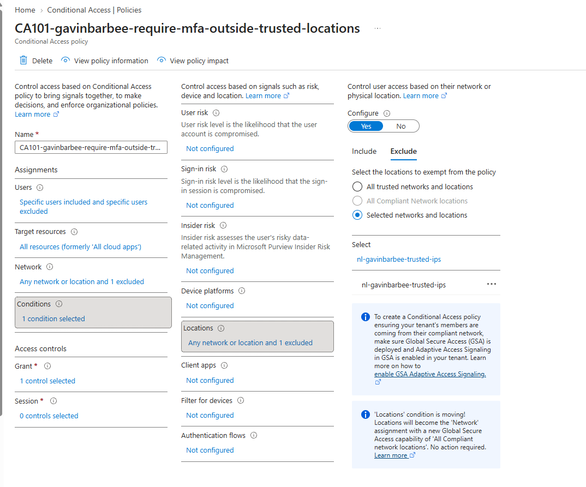
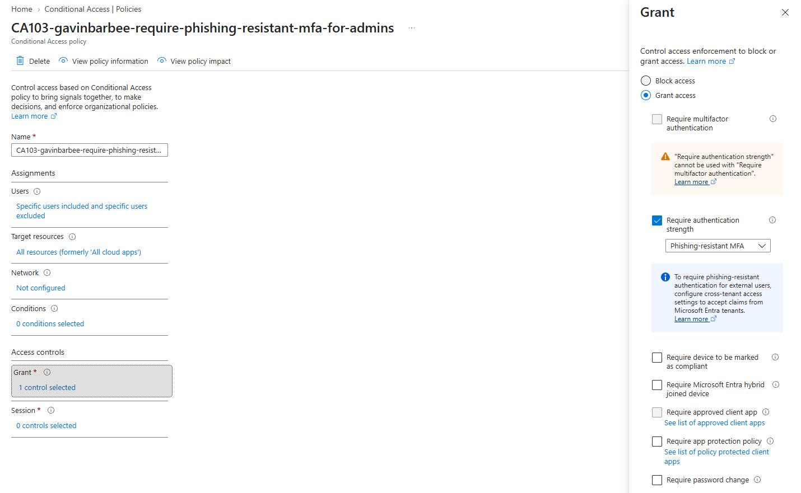
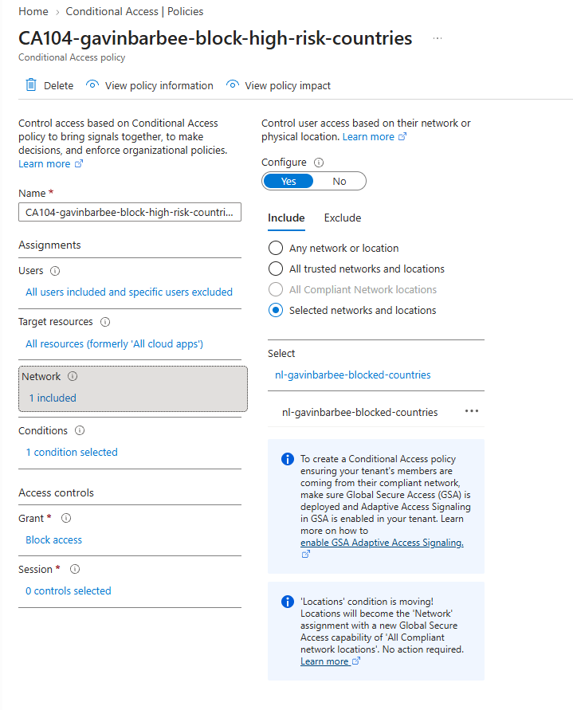
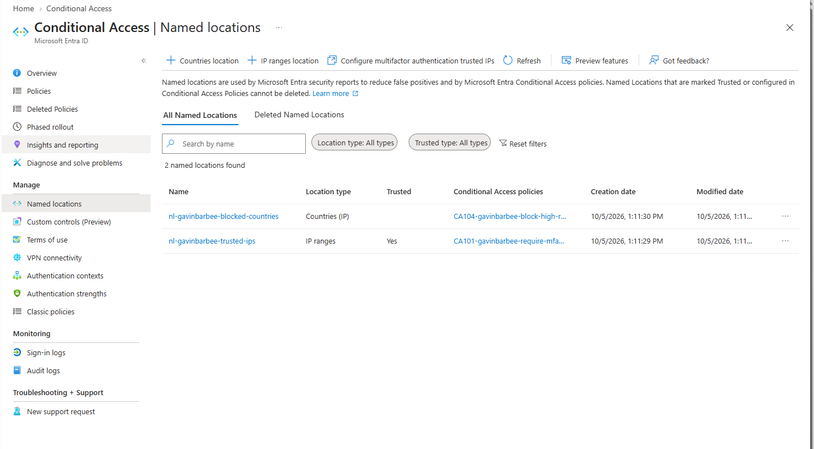

### 5. Simulate sign-ins with What If

In Conditional Access → Policies → **What If**, I simulated sign-ins before testing for real:

| Simulation | Result |
| --- | --- |
| Pilot user from my trusted IP | CA101 does **not** apply |
| Pilot user from `8.8.8.8` | CA101 applies: require MFA |
| `gavinbarbee-admin` | CA103 applies: phishing-resistant MFA |
| Pilot user, IP and country set to North Korea | CA104 applies: block (CA101 also applies) |
| `gavinbarbee-breakglass` | No CA101–CA104 policies apply |

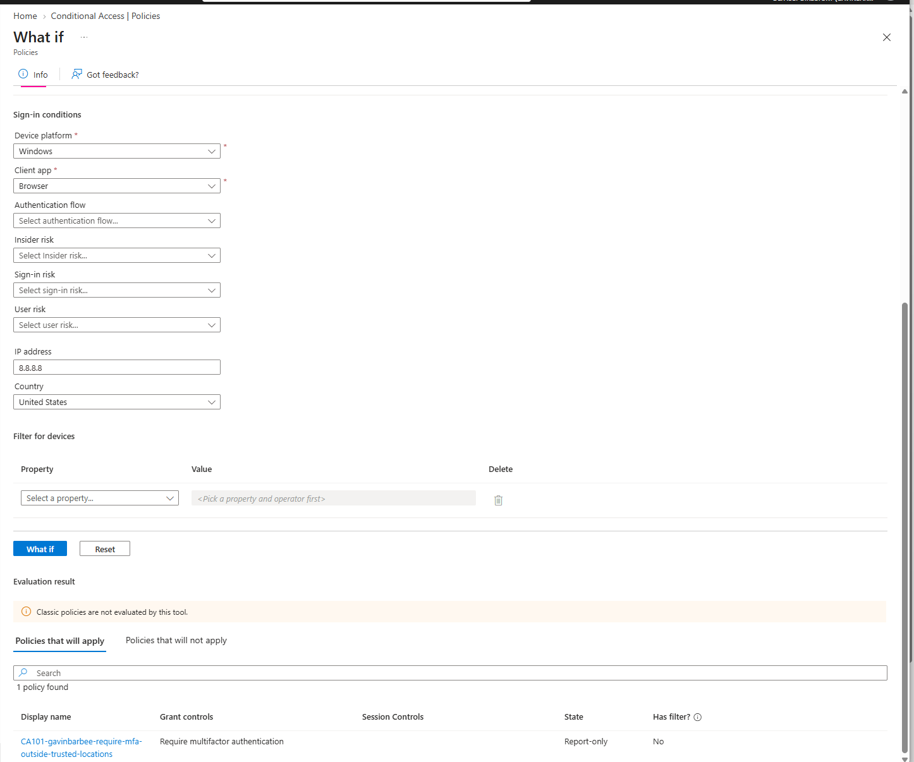
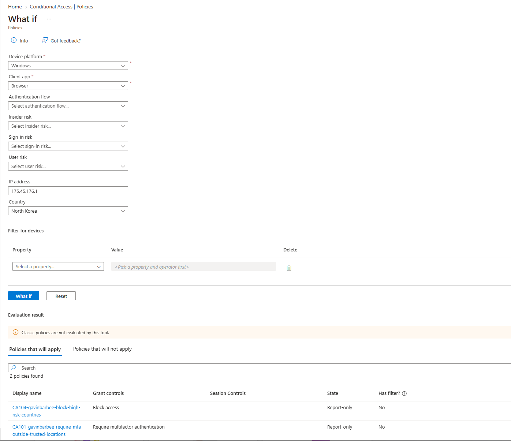
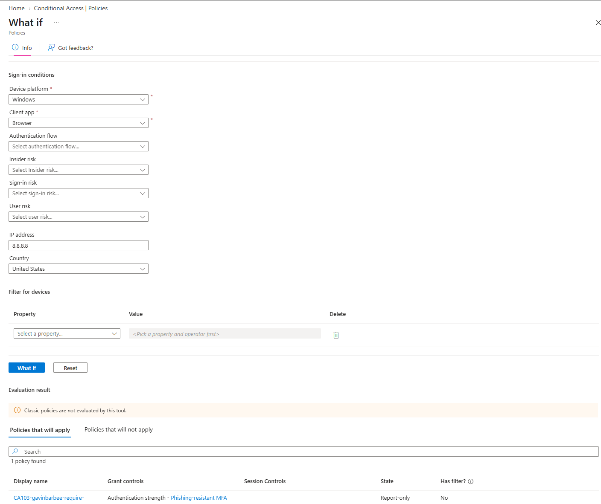

The North Korea simulation shows both CA104 and CA101 applying at once. When several policies match, all of them are evaluated, and the block wins.

### 6. Test real sign-ins and read the report-only results

```powershell
terraform output -raw pilot_user_password
```

I signed in as the pilot user at **myapps.microsoft.com** twice: once from my PC on my home network in an InPrivate window, and once from my phone on cellular data. In Entra ID → Monitoring & health → Sign-in logs, I opened each sign-in and checked the **Report-only** tab.

I expected CA101 to skip my home sign-in, since it should come from a trusted location. Instead, **both** sign-ins showed CA101 as **Report-only: User action required**, meaning it would have required MFA from home too. The sign-in details showed why: both sign-ins came in over **IPv6**, and my trusted location only contained my IPv4 address. The IPv4 lookup I used in Step 3 (`api.ipify.org`) only returns IPv4, so the address my browser actually used never made it into the trusted location.

CA102, CA103, and CA104 showed **Not applied** on both sign-ins, as expected: the pilot user isn't an admin, didn't use a legacy protocol, and signed in from the US.

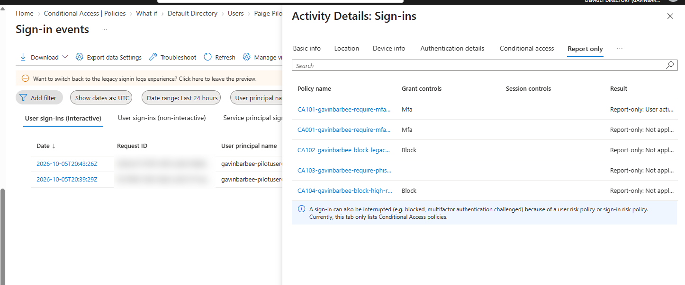

I left all four policies in report-only. Before enforcing CA101, the trusted location needs my home IPv6 prefix as a `/64` (home IPv6 addresses rotate within that block), followed by another round of report-only testing to confirm my home sign-in shows **Not applied**.

## Verification Checklist

- [x] Break-glass account exists, created outside Terraform, and is in `grp-gavinbarbee-ca-exclude`
- [x] Terraform app has only the six Graph application permissions listed above
- [x] All four policies deployed in report-only, each excluding the break-glass group
- [x] Trusted location is marked **Trusted** and the country location lists five countries
- [x] What If: CA101 applies to the pilot user from an untrusted IP, CA103 applies to my admin account, CA104 blocks a North Korea sign-in
- [x] What If: none of CA101–CA104 apply to the break-glass account
- [x] Report-only results reviewed for real sign-ins from home and cellular
- [x] Client secret deleted after deployment

## Troubleshooting

| Issue | Cause | Fix |
| --- | --- | --- |
| `terraform validate` failed: parsing the PolicyAuthenticationStrengthPolicy ID, "the number of segments didn't match" | The `azuread` 3.x provider expects the full resource path for `authentication_strength_policy_id`, not just the GUID | Changed it to `/policies/authenticationStrengthPolicies/00000000-0000-0000-0000-000000000004` |
| CA101 report-only showed "User action required" for my **home** sign-in, not just cellular | My browser signed in over IPv6, but the trusted location only had my IPv4 address (`api.ipify.org` only returns IPv4) | Caught in report-only before enforcement. The fix before enforcing is adding my home IPv6 prefix as a `/64` to `trusted_ip_cidrs` (`api64.ipify.org` returns the IPv6 address) |

## Cleanup

Recreate a client secret for the Terraform app and set the `ARM_*` environment variables first, then:

```powershell
cd terraform
terraform destroy
```

Afterward, delete the `sp-gavinbarbee-terraform-ca` app registration, close the terminal so the `ARM_*` variables are cleared, and permanently delete the pilot user from Deleted users. The break-glass account stays, since Terraform only read it.

## Key Takeaways

- Conditional Access runs after primary authentication. It doesn't replace the password check; it decides what a verified sign-in is allowed to do.
- Every matching policy applies, and a block in any one of them wins.
- Report-only mode earned its place: it showed CA101 would have prompted my whole home network for MFA because of IPv6, before a single user was affected.
- Trusted locations need to cover how users actually connect. Most networks now use IPv6 too, so an IPv4-only trusted location quietly misses real sign-ins.
- A break-glass exclusion on every policy is non-negotiable. The What If tool showed my older CA001 policy from a previous lab still applied to my new break-glass account, so adding one means checking every existing policy, not just new ones.
- Not all MFA is equal: authentication strengths let me require phishing-resistant methods where an account's privileges make it a target.
- In production I'd roll out in rings: fix the trusted location, confirm in report-only, enforce CA101 and CA102 for a pilot group, then expand to all users. CA103 waits until every admin has a passkey or FIDO2 key registered.

---

*Built by Gavin Barbee · [github.com/gavinbarbee](https://github.com/gavinbarbee) · Time to complete: ~1.5 hours*